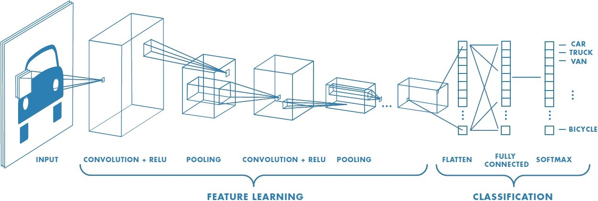
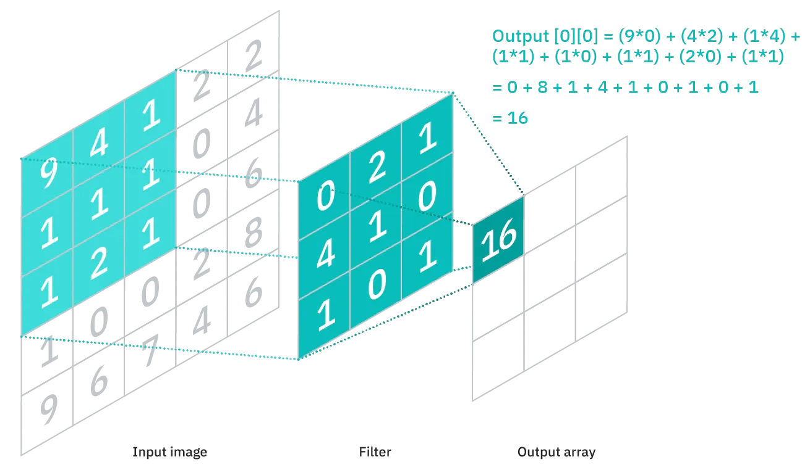
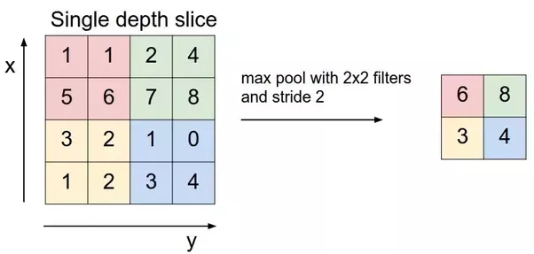

## Convolutional Neural Networks

**A convolutional neural network (CNN)** takes an input image and classifies it into any of the output classes. Each image passes through a series of different layers – primarily convolutional layers, pooling layers, and fully connected layers. The below picture summarizes what an image passes through in a CNN:

**The convolutional layer** is used to extract features from the input image. It is a mathematical operation between the input image and the kernel (filter). The filter is passed through the image and the output is calculated as follows:

**Pooling layers** are used to reduce the size of any image while maintaining the most important features. The most common types of pooling layers used are max and average pooling which take the max and the average value respectively from the given size of the filter (i.e, 2x2, 3x3, and so on).

Max pooling, for example, would work as follows:
